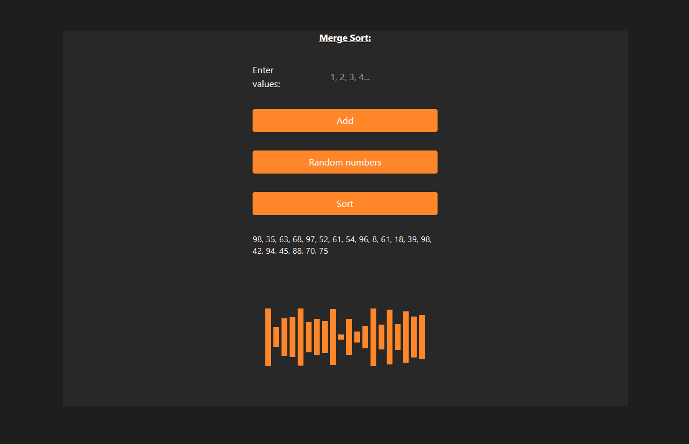

# Algograhix

## Overview
This project is a web application that visualizes popular sorting algorithms. It demonstrates how algorithms like Bubble Sort, Merge Sort, Insertion Sort and Selection Sort work by sorting an array of numbers step by step.

Users can either input their own set of numbers or generate random numbers to visualize how different algorithms sort them.

## Features
- **Five Sorting Algorithms**: Bubble Sort, Merge Sort, Insertion Sort and Selection Sort.
- **User-Provided Input**: Users can enter a list of numbers to see how each algorithm handles sorting.
- **Random Number Generation**: Alternatively, users can generate a random set of numbers for sorting.
- **Visual Feedback**: Watch as the array is sorted step by step, with dynamic visualizations updating in real-time.
- **Algorithm Complexity**: After sorting is complete, the time complexity of the algorithm is displayed.

## Project Structure

```bash
    /src
    ├── /algos         # Sorting algorithm logic (Bubble, Merge, etc.)
    ├── /components    # Reusable UI components like AlgoBlock
    ├── /pages         # Different pages such as algorithm selection and rendering
    ├── /util          # Utility functions and the algos config
    └── App.tsx        # Main application file with routing logic
```
## Technologies used
- React:
- TypeScript:
- TailwindCSS: 
- Vite:
- React Router

## Usage
**Installation**
1. Clone the repository:
   ```bash
   git clone https://github.com/Werries/AlgoGraphix.git
   
2. Install dependencies:
   ```bash
    npm install
   
3. Start the development server:
    ```bash
    npm run dev

## How to Use
1. Select a sorting algorithm on the algo page.
2. Enter a custom list of numbers or generate random numbers.
3. Click "Sort" to visualize the sorting process.
4. The time complexity will be displayed after sorting is complete.


